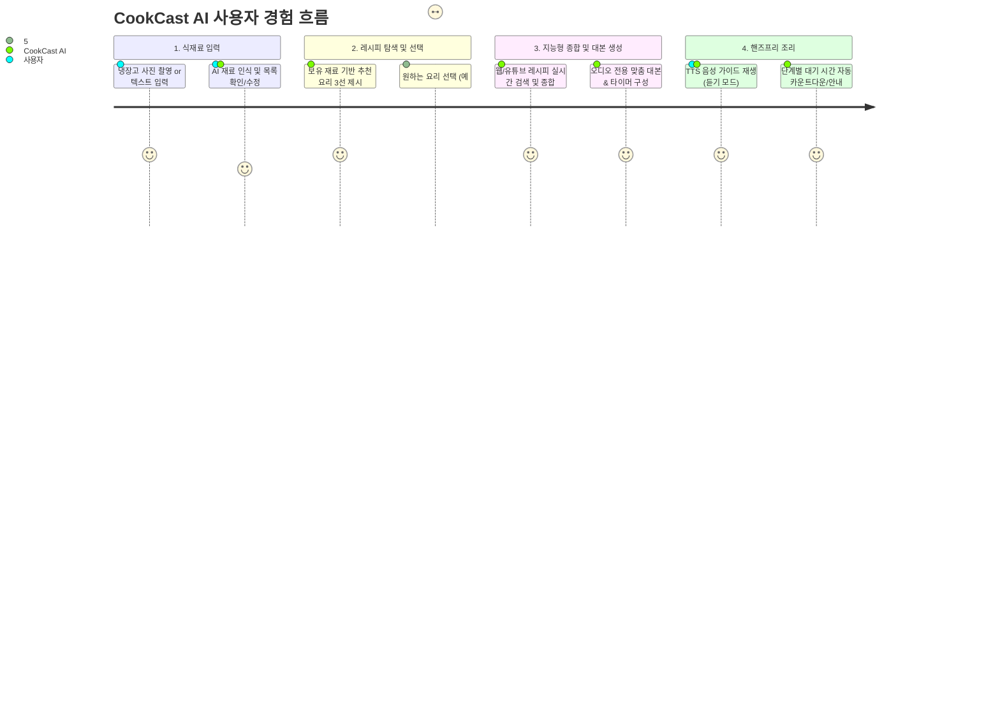
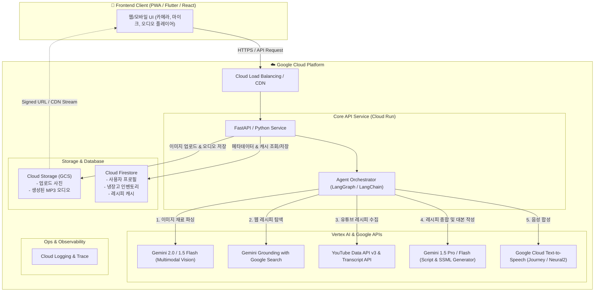

# 🍳 CookCast AI (쿡캐스트 AI)
## 냉장고 식재료 기반 실시간 레시피 종합 및 핸즈프리 오디오 가이드 AI 에이전트 기획안

---

## 1. 프로젝트 개요

### 1.1 프로젝트 명칭
- **서비스명:** **CookCast AI (쿡캐스트 AI)**
- **슬로건:** *"보는 요리에서 듣는 요리로 — 냉장고 사진 한 장으로 완성되는 나만의 핸즈프리 오디오 셰프"*

### 1.2 기획 배경 및 페인포인트
1. **냉장고 자투리 식재료 처리의 번거로움:**
   - 1인 가구 및 맞벌이 가구 증가로 냉장고 속 식재료가 방치되어 버려지는 음식물 쓰레기 문제 심각.
   - 보유 식재료만으로 만들 수 있는 레시피를 매번 포털이나 유튜브에서 일일이 검색하고 비교하는 데 많은 시간 소요.
2. **요리 중 스마트폰 조작의 불편함 (Hands-busy & Eyes-busy):**
   - 요리 중 손에 물, 기름, 양념이 묻어 화면을 터치하거나 스크롤하기 어려움.
   - 조리 도중 영상을 멈추거나 되감는 행위는 조리 흐름을 끊고 위생 문제를 유발.
3. **정보의 파편화:**
   - 인터넷 블로그, 유튜브 영상마다 재료 비율과 조리 순서가 제각각이라 초보자가 종합하여 판단하기 어려움.

### 1.3 해결 방안 및 핵심 가치
- **Multimodal AI Vision:** 냉장고 사진 한 장(또는 텍스트)으로 재료를 자동 식별 및 분류.
- **Search & Multi-Source Synthesis Agent:** 웹 블로그(텍스트)와 유튜브(영상 자막/타임라인)의 인기 레시피를 실시간으로 교차 검색하여 가장 신뢰도 높은 '황금 레시피'로 통합.
- **Audio-Optimized Scriptwriting:** 눈으로 읽는 글이 아닌, **"들으면서 요리할 수 있는 실전 오디오 가이드 대본"** 작성.
- **GCP Cloud TTS with SSML:** 단계별 쉼표(Pause), 타이머 알림, 조리 팁을 자연스러운 목소리로 읽어주는 핸즈프리 요리 코치 제공.

---

## 2. 서비스 핵심 기능 및 유저 저니 (User Journey)



### 2.1 단계별 상세 기능
1. **스마트 식재료 캡처 (Vision & Text Input):**
   - 냉장고 내부 사진 또는 식재료 모음 사진을 업로드하면 식재료명, 대략의 상태(신선도/양)를 자동 추출.
   - 사용자가 직접 텍스트로 보완(예: "양파 반 개, 계란 2개, 신김치, 스팸 있음") 가능.
   - 기본 조미료(간장, 설탕, 참기름 등) 보유 여부 기본 프로필 연동.
2. **레시피 후보 큐레이션 (Smart Recommendation):**
   - 식재료 매칭률 90% 이상의 '즉시 조리 가능 레시피'와 1~2개 대체 재료가 필요한 레시피 추천.
   - 난이도, 조리 시간(15분 컷, 30분 요리 등) 필터 제공.
3. **웹 & 유튜브 레시피 하이브리드 종합 (Recipe Synthesizer):**
   - 백종원, 류수영 등 공인된 유명 셰프 유튜브의 팁과 포털 상위 블로그 레시피를 교차 분석.
   - 불필요한 사설(인트로 인사말, 광고 등)을 제거하고, 핵심 재료 비율 및 불 조절 노하우 추출.
4. **오디오 대본화 및 음성 안내 (Audio Script & TTS):**
   - 요리 호흡에 맞춘 대본: [재료 준비] ➡️ [사전 손질] ➡️ [불 조절 및 조리] ➡️ [완성 및 플레이팅].
   - SSML(음성 마크업 언어)을 적용하여 "양파를 썰어주세요" 후 실제 칼질 시간 동안 5초 대기 또는 안내음 삽입.

---

## 3. GCP 기반 전체 시스템 아키텍처

Google Cloud의 최신 AI 기술과 서버리스 생태계를 결합하여 빠른 반응 속도와 확장성, 비용 효율성을 극대화합니다.



### 3.1 주요 GCP 컴포넌트 역할

| GCP 서비스                                  | 사용 목적                                       | 선정 사유                                               |
| :--------------------------------------- | :------------------------------------------ | :-------------------------------------------------- |
| **Vertex AI (Gemini 1.5/2.0 Flash)**     | 냉장고 사진 멀티모달 분석, 재료 리스트 추출                   | 밀리초 단위의 빠른 응답 속도, 낮은 토큰 비용, 강력한 비전 인식률              |
| **Vertex AI Grounding w/ Google Search** | 최신 웹 요리 블로그 및 전문 레시피 실시간 검색                 | 환각(Hallucination) 방지 및 신뢰도 높은 최신 계량 정보 확보           |
| **YouTube Data API v3**                  | 메뉴 관련 상위 인기 요리 영상 메타데이터 및 자막 추출             | 실제 셰프들의 팁(양념 비율, 불 세기) 수집                           |
| **Google Cloud Text-to-Speech (TTS)**    | 조리 대본을 오디오로 합성 (Neural2 / Journey 음성)       | 자연스러운 한국어 운율, SSML 태그 완벽 지원, 높은 가용성                 |
| **Cloud Run**                            | 백엔드 API 서버 (FastAPI 컨테이너)                   | 서버리스 기반 자동 스케일링 (0으로 축소 가능), 저비용 운영                 |
| **Cloud Storage (GCS)**                  | 원본 사진 및 생성된 TTS mp3 파일 저장                   | 저렴한 오브젝트 스토리지 및 서명된 URL(Signed URL)을 통한 빠른 오디오 스트리밍 |
| **Cloud Firestore**                      | 사용자 데이터, 보유 식재료, 레시피 대본 캐싱                  | 실시간 NoSQL DB, 빠른 조회 및 모바일 SDK와의 유연한 연동              |
| **Secret Manager**                       | Google Search / YouTube / Vertex AI 키 보안 관리 | 보안 규정 준수 및 안전한 인증서 관리                               |

---

## 4. AI 에이전트 상세 파이프라인 (5-Agent Chain)

```
[입력] 사진 / 텍스트
  │
  ▼
[Agent 1: Ingredient Vision Extractor] ──▶ 식재료 JSON 정규화
  │
  ▼
[Agent 2: Recipe Harvester] ──────────────▶ Google Search + YouTube 자막 수집
  │
  ▼
[Agent 3: Golden Recipe Synthesizer] ────▶ 재료 가감, 대체재 결정 및 통합 레시피 생성
  │
  ▼
[Agent 4: Voice Script & SSML Crafter] ──▶ 라디오 셰프 스타일 대본 + SSML 태그 부착
  │
  ▼
[Agent 5: TTS Audio Rendering Engine] ────▶ GCS MP3 저장 ➡️ 스트리밍 전달
```

### 4.1 에이전트별 세부 명세

#### Agent 1. 식재료 인식 에이전트 (Ingredient Vision Extractor)
- **엔진:** Gemini 2.0 / 1.5 Flash Multimodal
- **입력:** 냉장고 내부 사진 파일 (JPG/PNG) 또는 텍스트
- **역할:**
  - 사진 속 식재료 객체 디텍션 (채소, 육류, 소스, 유제품 등)
  - 보관 상태(신선도, 유통기한 임박 추정) 및 대략의 수량 태깅
  - Pydantic 스키마 기반 정형 JSON 출력 (`name`, `category`, `quantity_estimate`)

#### Agent 2. 레시피 탐색 에이전트 (Recipe Harvester)
- **엔진:** Vertex AI Grounding (Google Search) + YouTube Data API
- **역할:**
  - 추출된 식재료 조합으로 최적의 요리 키워드 생성 (예: *"돼지고기 앞다리살 신김치 두부 요리"*)
  - YouTube에서 조회수 50만 회 이상의 검증된 영상 3개와 네이버/다음 요리 블로그 상위 글 수집.
  - 영상의 자막(Transcript) 또는 요약 타임라인을 파싱하여 핵심 레시피 추출.

#### Agent 3. 황금 레시피 종합 에이전트 (Recipe Synthesizer)
- **엔진:** Gemini 1.5 Pro / Flash
- **역할:**
  - 수집된 복수 레시피 간 양념 비율의 공통점과 차이점 분석 (예: 간장 2큰술 vs 3큰술 ➡️ 중간치 2.5큰술 권장).
  - 사용자의 냉장고에 없는 재료에 대한 대체재 제안 (예: *"맛술이 없으면 미림이나 청주, 소주로 대체 가능"*).
  - 표준화된 요리 순서(Prep ➡️ Cook ➡️ Finish) 확정.

#### Agent 4. 오디오 대본 & SSML 생성 에이전트 (Script & SSML Crafter)
- **엔진:** Gemini 1.5 Pro (정교한 문체 조절)
- **역할:**
  - **라디오 팟캐스트/오디오 가이드 문체** 적용: 친절하고 활기찬 톤 ("안녕하세요! 오늘은 냉장고에 있는 돼지고기와 김치로 밥도둑 김치찜을 만들어볼게요.")
  - **요리 호흡 동기화:** 동작 후 지연이 필요한 구간에 `<break time="3s"/>` 삽입.
  - **시각적 비유:** "노릇노릇해질 때까지", "보글보글 끓어오르면" 등 귀로 상상할 수 있는 감각적 표현 사용.

#### Agent 5. 오디오 렌더링 & 캐싱 엔진 (TTS Audio Engine)
- **엔진:** Google Cloud TTS (`ko-KR-Neural2-A` 또는 `ko-KR-Journey-F`)
- **역할:**
  - SSML 구문을 파싱하여 고품질 MP3 음원 파일 생성.
  - 전체 통파일 1개 + 단계별(Step 1, Step 2, Step 3...) 개별 음원 청크 분할 저장 (사용자가 특정 단계를 다시 듣거나 건너뛸 수 있도록 지원).
  - Cloud Storage에 저장 후 Signed URL 발급.

---

## 5. 핸즈프리 오디오 특화 대본 & SSML 설계 예시

### 5.1 AI 대본 생성 프롬프트 가이드라인 (System Instruction)
```
당신은 사용자의 곁에서 1:1로 요리를 가르쳐주는 친절한 오디오 셰프 에이전트입니다.
사용자는 지금 요리 중이라 스마트폰 화면을 볼 수 없고, 손에 물이 묻어 있습니다.
따라서 다음 규칙을 반드시 지켜 음성 전용 대본(SSML 포맷)을 작성해야 합니다:

1. 시각적 표현 대신 감각적/직관적 표현을 사용하세요. (예: "사진처럼 썰어주세요" ❌ -> "손가락 두 마디 크기로 깍둑썰기 해주세요" ⭕)
2. 각 행동 사이에는 사용자가 움직일 수 있는 물리적 여유를 고려하여 SSML <break time="..."/> 태그를 적절히 배치하세요.
3. 불 조절과 타이머는 매우 명확하게 짚어주세요. (예: "지금 가스레인지 불을 중불로 켜고, 5분간 끓여주세요.")
4. 단계(Step)별로 청크를 나누어 반환하세요.
```

### 5.2 생성되는 SSML 대본 예시

```xml
<speak>
  <p>
    안녕하세요! 오늘 냉장고에 있는 재료로 <emphasis level="moderate">15분 만에 끝내는 스팸 김치볶음밥</emphasis>을 시작해볼게요.
    먼저 도마 위에 김치 반 공기, 스팸 반 캔, 그리고 대파 한 대를 준비해주세요.
  </p>
  <break time="2s"/>
  
  <s>첫 번째 단계, 재료 썰기입니다.</s>
  <p>
    대파는 얇게 송송 썰어주시고, 스팸은 옥수수알 크기로 잘게 깍둑썰기 해주세요.
    김치는 가위로 밥그릇 안에서 잘게 잘라두면 설거지거리가 줄어든답니다.
  </p>
  <break time="4s"/>

  <s>두 번째 단계, 파기름과 햄 볶기입니다.</s>
  <p>
    팬에 식용유 두 스푼을 두르고, 중불을 켜주세요.
    썰어둔 대파와 스팸을 넣고 달달 볶아줍니다.
    스팸 겉면이 노릇해지면서 맛있는 기름 냄새가 올라올 때까지 1분 정도 볶아주세요.
  </p>
  <break time="3s"/>

  <s>세 번째 단계, 양념과 김치 투하입니다!</s>
  <p>
    이제 진간장 한 스푼을 팬 가장자리에 둘러 눌어붙게 불맛을 내준 다음, 썰어둔 김치를 넣으세요.
    그리고 설탕 반 스푼을 톡톡 뿌려 신맛을 잡아줍니다.
  </p>
</speak>
```

---

## 6. 데이터베이스 및 캐싱 설계 (Firestore)

### 6.1 컬렉션 구조
- **`users/{userId}`**: 사용자 선호(알레르기, 비건 여부, 보유 기본 조미료 리스트)
- **`pantry_items/{userId}/items`**: 현재 냉장고에 저장된 식재료 (수량, 유통기한, 등록일)
- **`recipe_cache/{recipeHash}`**: 이미 생성된 인기 레시피 및 대본 (중복 Vertex AI 및 TTS 호출 방지)
  ```json
  {
    "ingredient_fingerprint": ["kimchi", "spam", "green_onion"],
    "dish_name": "스팸 김치볶음밥",
    "sources": [
      {"title": "백종원 김치볶음밥", "url": "https://youtube.com/..."},
      {"title": "만개의레시피 김치볶음밥", "url": "https://10000recipe.com/..."}
    ],
    "audio_script_text": "안녕하세요! 오늘 냉장고에 있는...",
    "audio_url": "https://storage.googleapis.com/.../recipe_123.mp3",
    "step_audios": [
      {"step": 1, "title": "재료 썰기", "audio_url": ".../step1.mp3", "duration_sec": 42},
      {"step": 2, "title": "파기름 내기", "audio_url": ".../step2.mp3", "duration_sec": 55}
    ],
    "created_at": "2026-09-16T17:30:00Z"
  }
  ```

---

## 7. 단계별 개발 로드맵 (Roadmap)

```
Phase 1: 핵심 파이프라인 PoC ──▶ Phase 2: 검색 & 대본 고도화 ──▶ Phase 3: 클라우드 배포 ──▶ Phase 4: 양방향 고도화
      (1 ~ 2주차)                    (3 ~ 4주차)                 (5 ~ 6주차)               (7 ~ 8주차)
```

### Phase 1: AI 파이프라인 프로토타입 (1~2주차)
- [x] GCP 프로젝트 설정 (Vertex AI, Cloud TTS, GCS 권한)
- [ ] Gemini 1.5/2.0 Flash 기반 냉장고 사진 식재료 인식 프롬프트 튜닝
- [ ] 단일 텍스트/이미지 입력 ➡️ 레시피 생성 ➡️ Cloud TTS(MP3) 변환 엔드투엔드 Python 스크립트 검증

### Phase 2: 멀티 에이전트 & 검색 종합 (3~4주차)
- [ ] Vertex AI Search Grounding 및 YouTube API 연동 파이프라인 구축
- [ ] 레시피 신뢰도 비교 및 종합 엔진 (양념 비율 정규화) 구현
- [ ] 요리 호흡 맞춤형 SSML 대본 템플릿 개발 및 음질/발화 속도 튜닝

### Phase 3: GCP 클라우드 서비스화 & 웹 UI (5~6주차)
- [ ] FastAPI 백엔드 개발 및 Cloud Run 컨테이너 배포
- [ ] Cloud Storage 연동 및 Signed URL 기반 오디오 스트리밍 구현
- [ ] 모바일 친화적 반응형 PWA 프론트엔드 제작 (오디오 플레이어, 단계별 이전/다음 버튼, 큰 폰트 모드)

### Phase 4: 양방향 핸즈프리 음성 대화 고도화 (7~8주차)
- [ ] Cloud Speech-to-Text(STT) 또는 Gemini Multimodal Live API 연동
- [ ] 요리 중 음성 질의 기능 지원 (예: *"헤이 셰프, 간장 몇 스푼 넣으라고 했지?", "3분 타이머 맞춰줘"*)
- [ ] 영양성분 및 알레르기 안전 가드레일 접목

---

## 8. 예상 비용 분석 및 최적화 전략 (GCP FinOps)

### 8.1 예상 비용 요인 (월 1,000회 레시피 생성 기준)
1. **Vertex AI (Gemini 1.5/2.0 Flash):**
   - 이미지 인식: 건당 약 $0.002
   - 텍스트 검색 & 대본 작성: 건당 약 $0.0015
   - ➡️ 월 약 $3 ~ $5 내외 (매우 저렴)
2. **Google Cloud Text-to-Speech (Neural2 / Journey):**
   - 1회 레시피당 약 1,500자 ~ 2,000자
   - 1,000회 기준 약 200만 자
   - Cloud TTS 무료 할당량(월 100만 자) 차감 후 ➡️ 월 약 $16 내외
3. **Cloud Run & Storage:**
   - 호출량 대비 트래픽 미미하여 Free Tier 범위 내 커버 가능 (월 $1 미만)

### 8.2 비용 절감 전략
- **레시피 캐싱:** 인기 있는 식재료 조합(예: 김치+스팸, 두부+된장 등)은 Firestore와 GCS에 캐시하여 AI 모델과 TTS 중복 호출 0건화.
- **스트리밍 분할:** 전체 오디오를 한 번에 생성하기 전, 1단계 오디오를 먼저 생성하여 사용자 대기 시간(TTFB)을 1초 미만으로 단축.

---

## 9. 성공 지표 (KPI)
- **식재료 인식 정확도:** 92% 이상
- **대본 생성 및 TTS 첫 소절 재생 대기시간:** 3.5초 이내
- **오디오 가이드 완주율:** 70% 이상 (요리가 끝날 때까지 청취)
- **사용자 만족도:** 핸즈프리 사용 편의성 평점 4.5 / 5.0 이상
